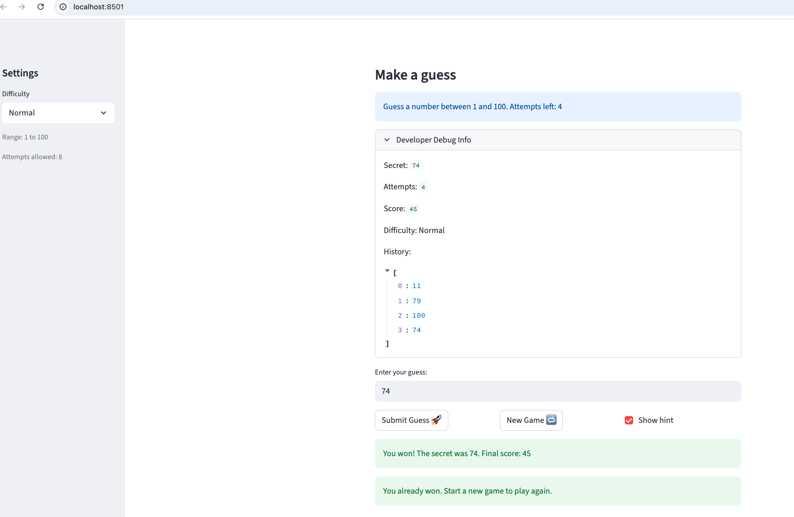

# 🎮 Game Glitch Investigator: The Impossible Guesser

## 🚨 The Situation

You asked an AI to build a simple "Number Guessing Game" using Streamlit.
It wrote the code, ran away, and now the game is unplayable. 

- You can't win.
- The hints lie to you.
- The secret number seems to have commitment issues.

## 🛠️ Setup

1. Install dependencies: `pip install -r requirements.txt`
2. Run the broken app: `python -m streamlit run app.py`

## 🕵️‍♂️ Your Mission

1. **Play the game.** Open the "Developer Debug Info" tab in the app to see the secret number. Try to win.
2. **Find the State Bug.** Why does the secret number change every time you click "Submit"? Ask ChatGPT: *"How do I keep a variable from resetting in Streamlit when I click a button?"*
3. **Fix the Logic.** The hints ("Higher/Lower") are wrong. Fix them.
4. **Refactor & Test.** - Move the logic into `logic_utils.py`.
   - Run `pytest` in your terminal.
   - Keep fixing until all tests pass!

## 📝 Document Your Experience

### 🎯 Game Purpose

The Game Glitch Investigator is a number-guessing game built with Streamlit. Players choose a difficulty level:

1) Easy: numbers from 1–20 with 6 attempts

2) Normal: numbers from 1–100 with 8 attempts

3) Hard: numbers from 1–200 with 5 attempts

The goal is to guess a hidden secret number before running out of attempts.

After each guess, the game gives a hint , either “Go HIGHER!” or “Go LOWER!” — to help guide the player in the right direction.

---

###  Bugs Found

1. **Hints were reversed** — The Higher/Lower hints pointed the wrong way. Guessing too high told you to go higher, and guessing too low told you to go lower.
2. **Hard mode was too easy** — Hard had a range of 1–50, which was actually smaller than Normal's 1–100.
3. **Secret number kept changing** — Every button click re-ran the script and picked a new secret, so the target moved with every guess.
4. **New Game didn't fully reset** — Only the secret was regenerated. The input field and guess history carried over from the previous game.
5. **Score was wrong** — On even-numbered wrong guesses, points were added instead of deducted.
6. **Range display was hardcoded** — The game always showed "between 1 and 100" regardless of the selected difficulty.
7. **UI was one step behind** — The score, history, and debug info only updated after the next interaction, not immediately after each guess.

---

### 🔧 Fixes Applied

1. **Corrected the hint logic** — Swapped the return values in `check_guess()` so higher guesses say "Go LOWER!" and lower guesses say "Go HIGHER!".
2. **Fixed Hard mode range** — Changed the upper bound in `get_range_for_difficulty()` from 50 to 200.
3. **Persisted the secret in session state** — Moved secret generation inside an `if "secret" not in st.session_state` check so it only runs once per game.
4. **Full reset on New Game** — Cleared all session state variables (secret, attempts, score, status, history, feedback) and incremented `game_count` to force a fresh input field.
5. **Consistent score deduction** — Removed the even/odd condition in `update_score()` so a wrong guess always deducts 5 points.
6. **Dynamic range display** — Replaced the hardcoded string with `{low}` and `{high}` pulled from `get_range_for_difficulty()`.
7. **Fixed UI timing** — Moved all state updates before `st.rerun()` so the display reflects each guess immediately.

## 📸 Demo

- [ ] [Insert a screenshot of your fixed, winning game here]

## 🚀 Stretch Features

- [ ] [If you choose to complete Challenge 4, insert a screenshot of your Enhanced Game UI here]
